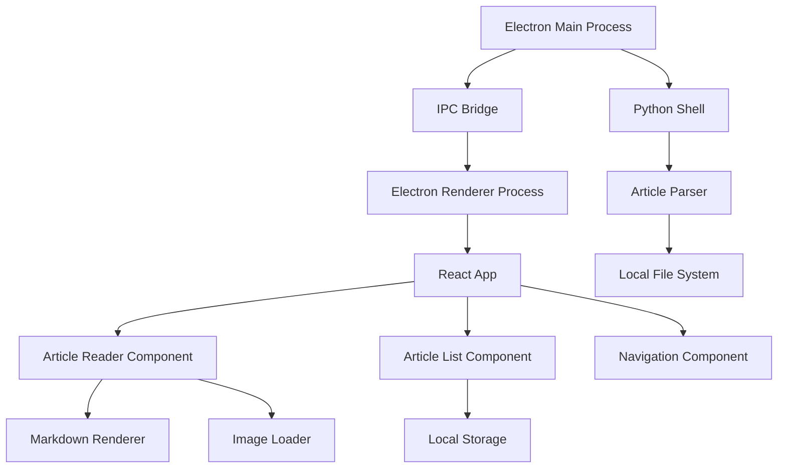

# Weixin Topic Reader

微信话题阅读器 - 一个优雅的微信公众号文章阅读器，让你以更舒适的方式阅读和管理微信公众号文章，支持微信话题的订阅管理、即时刷新、阅读计数等等。


[手把手带你从零到一使用 AI 实战：微信话题订阅阅读器的实现 - bilibili 视频回放](https:////player.bilibili.com/player.html?isOutside=true&aid=113804989960969&bvid=BV1HicWe8Eis&cid=27802010131&p=1)

## ✨ 特性

- 📱 支持本地化阅读微信公众号文章
- 🎨 优雅的 Markdown 渲染
- 🖼️ 支持图片资源本地加载
- 💻 跨平台支持 (Windows/Mac/Linux)
- 📦 文章本地存储与管理

## 🚀 快速开始

### 环境要求

- Node.js 16+
- npm 8+

### 安装依赖

```bash
npm install
```

### 开发模式运行

```bash
npm run electron:dev
```

### 打包构建

```bash
npm run electron:build
```

## 🛠️ 技术栈

- Electron
- React 
- TypeScript
- Vite
- Tailwind CSS
- MDX

## 系统架构图



## 代码量

```shell
$ cloc src/* main.py electron/*                                                                                                                                                            master ✖︎ [23:37:33]
      20 text files.
      20 unique files.
       0 files ignored.

github.com/AlDanial/cloc v 2.02  T=0.06 s (321.2 files/s, 20463.2 lines/s)
-------------------------------------------------------------------------------
Language                     files          blank        comment           code
-------------------------------------------------------------------------------
TypeScript                      16             80             93            641
Python                           1             60             63            286
CSS                              2              6              1             43
SVG                              1              0              0              1
-------------------------------------------------------------------------------
SUM:                            20            146            157            971
-------------------------------------------------------------------------------
```

## Roadmap

### 短期优化（Maybe）

V1.1
- 话题管理功能
- 文章搜索功能
- 文章分类管理
- AI 总结文章摘要

### 长期 Roadmap（Maybe）

V2.0
- 文章分享
- 笔记功能
- 评论系统
- 自动同步
- 云端同步

V3.0 - AI 赋能
- 智能推荐

## 📝 License

MIT License
